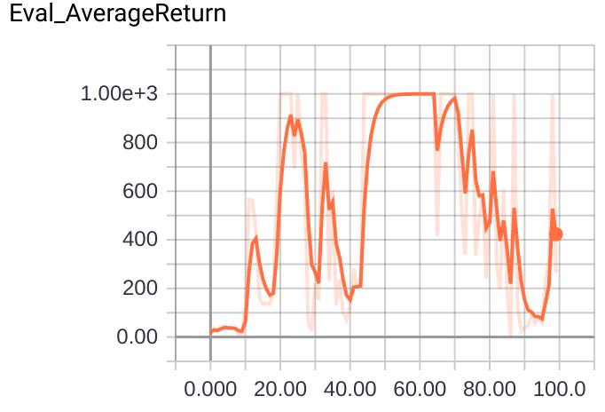

## CS285 Fall 2019 - HW2 Report

---

_Disclaimer: These assignments are my own work and have not been evaluated_

---


### CartPole-v0

>In the first graph, compare the learning curves (average return at each iteration) for the experiments prefixed with sb_. (The small batch experiments.)


>In the second graph, compare the learning curves for the experiments prefixedwith lb_. (The large batch experiments.)


>Which value estimator has better performance without advantage-standardization:
the trajectory-centric one, or the one using reward-to-go?

The reward to go version performed significantly better.

>Did advantage standardization help?

Yes it did.

>Did the batch size make an impact?

Yes, larger batch size led to more stable training.

### InvertedPendulum

>Given the b* and r* you found, provide a learning curve where the policy gets to
optimum (maximum score of 1000) in less than 100 iterations. (This may be for a
single random seed, or averaged over multiple.)

batch size = 200, learning rate = 0.04




>Provide the exact command line configurations you used to run your experiments.
```bash
python run_hw2_policy_gradient.py --env_name InvertedPendulum-v2 --ep_len 1000 --discount 0.9 -n 100 -l 2 -s 64  -b 200 -lr 0.03  --exp_name ip_b200_r0.04
```

### LunarLander

>Plot a learning curve for the above command. You should expect to achieve an average
return of around 180.


### HalfCheetah

>Provide a single plot with the learning curves for the HalfCheetah experiments that
you tried. Also, describe in words how the batch size and learning rate affected task
performance.


Higher batch size works better than smaller by reducing variance. Higher learning rate helps converge faster and to a higher value.

The best paramter was 50000 batch size and 0.02 LR.

> Provide a single plot with the learning curves for these four runs. The run
with both reward-to-go and the baseline should achieve an average score close to 200.


### Bonus

For Bonus I implemented GAE- λ. The graph below compares average and max-returns on Walked2D with a neural network baseline vs GAE with lambda = 0.3.


