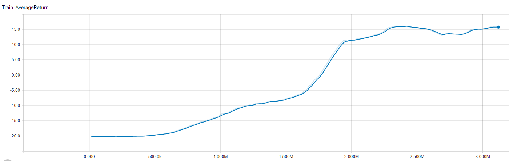
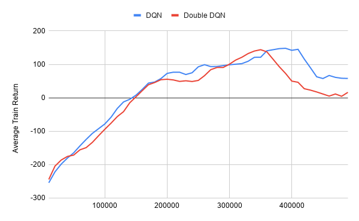
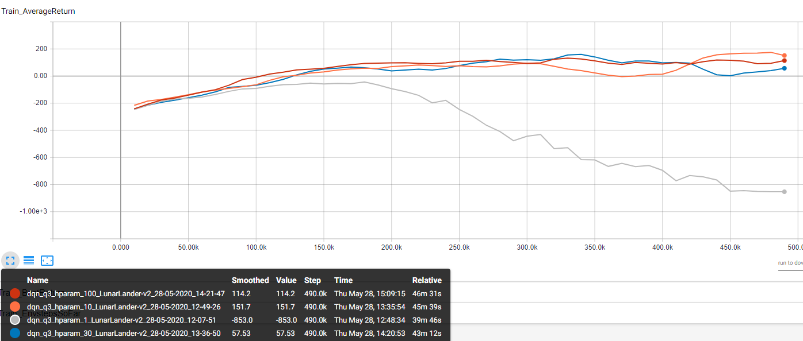
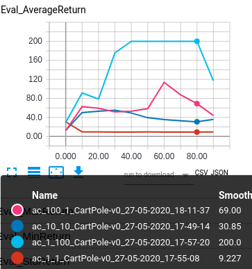
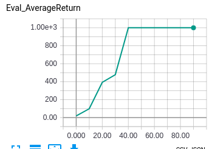
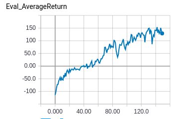

## CS285 Fall 2019 - HW3 Report

---

_Disclaimer: These assignments are my own work and have not been evaluated_

---

### Deep Q Learning

>Question 1:  basic Q-learning performance.  (DQN)Include a learningcurve plot showing the performance of your implementation on the game Pong.The x-axis should correspond to number of time steps (consider using scientificnotation) and the y-axis should show the mean 100-episode reward.

>Question  2:  double  Q-learning  (DDQN).Use  the  double  estimator  toimprove  the  accuracy  of  your  learned  Q  values.   This  amounts  to  using  theonline Q network (instead of the target Q network) to select the best action whencomputing target values.  Compare the performance of DDQN to vanilla DQN.

>Question 3:  experimenting with hyperparameters.Now let’s analyzethe sensitivity of Q-learning to hyperparameters.  Choose one hyperparameterof your choice and run at least three other settings of this hyperparameter, inaddition to the one used in Question 1,  and plot all four values on the samegraph.

Low batch size has an extremely strong affect. I think the return plummeted after a certain point because the Q function might have gotten too bad. This is possible because of extremely high variance

After a certain batch size, increase doesn't lead to more performance but stability in average returns in improved. Again, higher samples leading to lower variance.

### Actor-Critic

>Question 4: Sanity check with Cartpole. Compare the results for the following settings and reportwhich worked best.  Do this by plotting all the runs on a single plot and writing your takeaway in the caption.

Target updates are less important than critic updates.

>Question  5:  Run  actor-critic  with  more  difficult  tasks. Use  the  best setting  from  the  previous  question  to  run  InvertedPendulum  and  HalfCheetah

