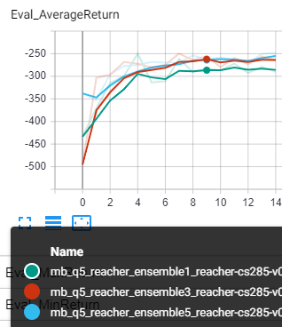
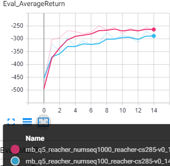

## CS285 Fall 2019 - HW4 Report

---

_Disclaimer: These assignments are my own work and have not been evaluated_

---

### Model Based Reinforcement Learning with Model Predictive Control

>Question 1: Collect a large dataset by executing random actions. Train a neural network
dynamics model on this fixed dataset and visualize the resulting predictions.
The implementation that you will do here will be for training the dynamics
model, and comparing its predictions against ground truth

>(b) qualitative model prediction plots for the 2 network sizes (runs 1,2)

  
   

Left is size 1x32 and right is 2x250

>(c) qualitative model prediction plots for the 2 of training steps (runs 2,3)

  
   

Left is size 5 and right is 500 steps

>Question  2:  Action selection using your learned dynamics model and a given reward function.

>Submit this run as part of your run logs, and include a plot of Train_AverageReturn and Eval_AverageReturn in your pdf. Note that these will just be single dots on the plot, since we ran this for just 1 iteration.

  
   

>Question 3:  MBRL algorithm with on-policy data collection and iterative model training.You should expect rewards of around -25 to -20 for the obstacles env (takes 40
minutes), rewards of around -250 to -300 for the reacher env (takes 2-3 hours),
and rewards of around 250-350 for the cheetah env takes 3-4 hours. All numbers
assume no GPU.

>Submit these runs as part of your run logs, and include the performance plots
in your pdf.

  
   
   

Left is cheetah, middle is osbtacles and right mose is reacher.

>Question 4: You will compare the performance of your MBRL algorithm as a function of
three hyperparameters: the number of models in your ensemble, the number of
random action sequences considered during each action selection, and the MPC
planning horizon.

#### Ensemble Size

Ensemble size has a very weak effect on average return. It seems to make initial training a bit faster and having 3 or 5 doesn't affect. This is because having a larger ensemble only matters when our initial model is very inaccurate and the returns diminish very quickly.

#### Number of Action Sequences

Having more action sequences considered increases performance as expected because the controller has more options to choose from that will explore the action space better.

#### Horizon

Planning for a very long horizon using a random smapling method is a bad idea because of the curse of dimensionality. The longer the horizon is the more sparse are samples will be. The graph also shows worst performance by the longest horizon and comparable performance of smaller horizons. This can be improved by better planners like LQR.
