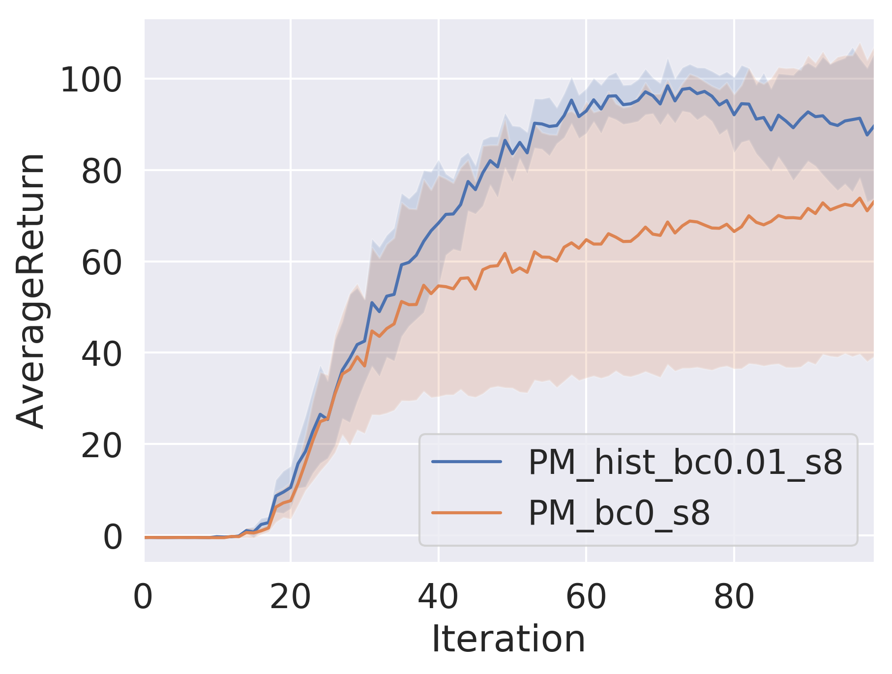
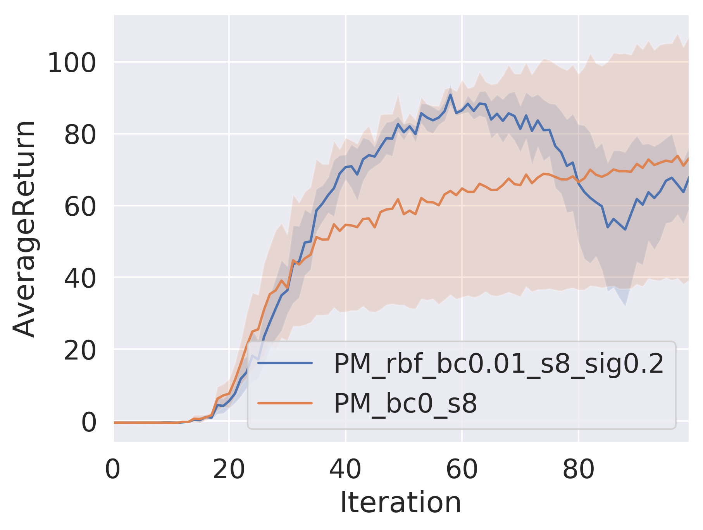
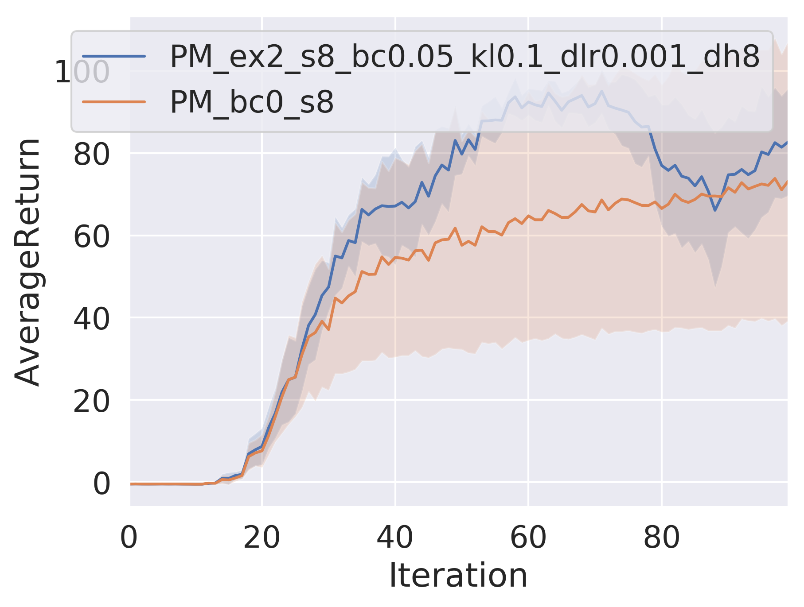
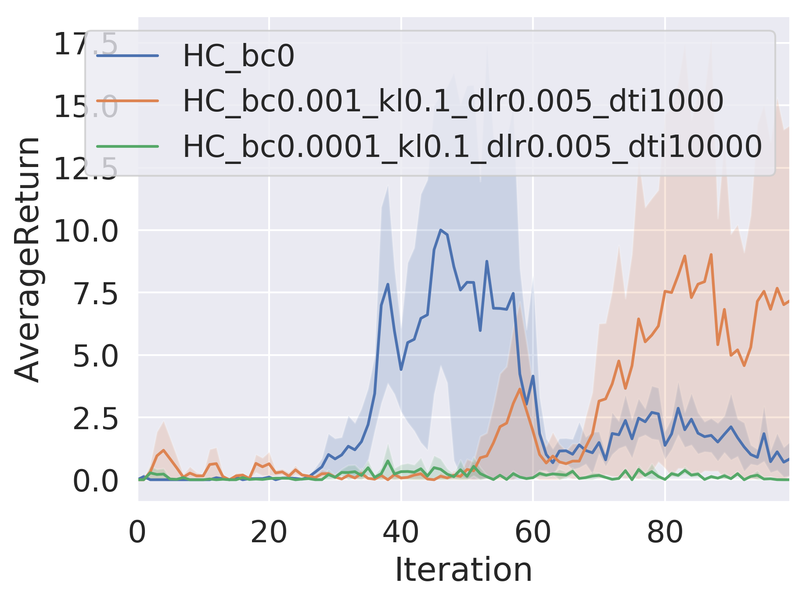

## CS285 Fall 2019 - HW5 Report

---

_Disclaimer: These assignments are my own work and have not been evaluated_

---

#### The reward modification (Eqn. 1), the count-based reward bonus (Eqn. 1), and the histogram density model .

>A plot with 2 curves comparing an agent with histogrambased exploration and an agent with no exploration.

#### The heuristic reward bonus (Eqn. 1), and the kernel density estimator with the radial basis function kernel.

> A plot with 2 curves comparing an agent with KDEbased exploration and an agent with no exploration.

#### The EX2 discriminator

> A plot with 2 curves comparing an agent with EX2-based exploration and an agent with no exploration.

#### EX2 Discriminator in harder problem

>A plot with 3 curves comparing the agents with EX2-
based exploration and an agent with no exploration.

The hyperparameter controlling reward bonus is very important. It seems that the green line with 1e-4 bonus provides too little bonus for valuable reward change. The no bonus case seems to have been lucky and hit a high reward area initially before stagnating. The run with 1e-3 bonus coefficient works best. 